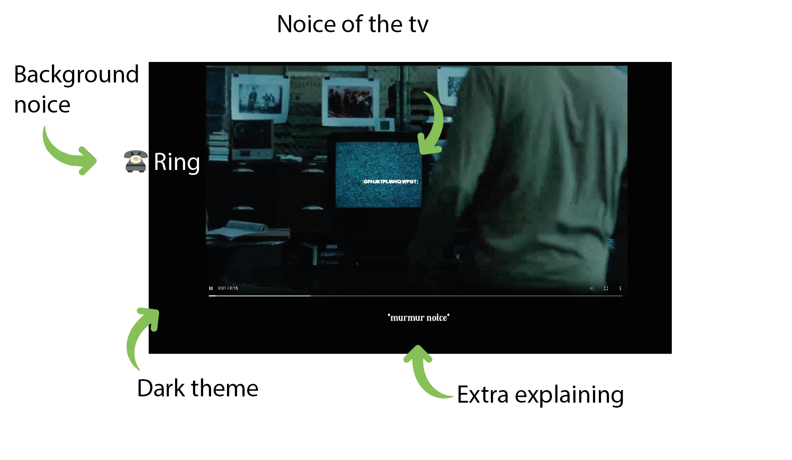

# HCD

## 📝 Project Description

Depicting a movie scene for Marie. Marie is a lecturer in Communication & Multimedia Design at the Amsterdam University of Applied Sciences. Marie has a disability, as she is deaf. Marie was born deaf, and no one knows why. Marie is very adept at lip-reading and communicates with her class with the help of a sign language interpreter.

## 🤔 What have I incorporated?

###  Study Situation 

Marie is a lecturer in Communication & Multimedia Design at the Amsterdam University of Applied Sciences. She is deaf but has a great love for films and series. Marie shows how you can understand and appreciate films and series even if you can't hear them.

Marie cannot hear sounds in films, such as where voices are coming from. This is challenging because sound tells a lot about what is happening in a film. Therefore, Marie pays extra attention to everything she sees, such as how people look or where they stand. This helps her understand what is happening.

A major issue for Marie is that the subtitles are often inadequate. Sometimes they only describe "tense music," which does not convey what the music contributes to the story. Marie believes it is crucial to improve subtitle quality. She also teaches her students about the importance of making films and series understandable for everyone, including those who cannot hear. She challenges her students to think about how everyone can enjoy a film, with or without sound.

###  Ignore Conventions 

Marie is deaf but that does not stop her. Marie often finds that the subtitles in films are not good enough. It frustrates her when it's hard to tell who is saying what or how the music makes the film exciting.

Because she is deaf, Marie uses an interpreter in class. This allows her to communicate effectively with her students. Marie teaches her students that they don't always have to follow the usual rules. She shows that sometimes you need to find new ways to solve problems.

Marie wants films and lessons to be clear for everyone, including those who cannot hear. She challenges her students to think about how they can do things differently. This way, they become more creative and can help everyone, not just those who can hear. This is how Marie breaks conventional rules and brings new ideas into her lessons.

###  Prioritize Identity 

Focus on the person, incorporating what she wants

Marie is not afraid to say that the subtitles in many films are not good enough. She wants this to improve, not just for herself, but for everyone who is deaf or hard of hearing. Her fight for better subtitles shows how important her identity is in her struggle for equality.

By prioritizing her identity, Marie teaches her students an important tip: "Watch a movie without sound and consider what could be visually added to improve the user experience of the film for everyone."

###  Add Nonsense 

### Moving (rotating) screen

During the

### Opacity

From the moment the zombie appears on screen, the screen's opacity changes between 1.0 and 0.5 every half second.

## 🧑🏼‍💻 Testing

I have tested my work with Marie once a week. Here is everything you need to know.

##  Test 1 

### Feedback from Marie

I showed Marie my selected video and explained my idea. I chose a scene from the movie 'The Ring', a well-known horror film. The film doesn't have much dialogue, but the sound creates a lot of tension which enhances the viewer's experience.

### Feedback from Instructor (Vasilis)

- Make it scarier
- Depict TV static visually
- Visual representation of the ringing of a mobile phone
- Changing the background color is a good idea
- Sudden sound or sudden silence

<b>"Visual pain hurts!!" ~ Vasilis </b>

##  Test 2 

### Who says the text?

In the scene, it’s crucial to clearly identify which character is speaking, especially since the sound cannot be heard. To address this, I have ensured that subtitles are not only accurate but are also positioned near the speaker’s image on the screen. This visual cue helps viewers, including those who are deaf like Marie, to easily follow the dialogue and connect it with the corresponding character.

### Go into detail, a bell rings -> what kind of bell

When a bell rings in the scene, the subtitle must specify the type of bell to help convey the atmosphere. For instance, the subtitle might read "sharp doorbell rings" if it's meant to signal a visitor at the door, or "soft service bell tinkles" for a quieter, more ambient sound like in a shop. These detailed descriptions help to paint a more vivid picture and enhance the viewing experience for those who cannot hear the sound.

### Subtitles close to the person

Positioning subtitles close to the speaking person is essential for clear communication. This method helps viewers quickly and accurately identify who is talking without the auditory cues that hearing viewers would typically rely on. For each scene, I carefully place subtitles near the character who is speaking. This placement is especially adjusted when the scene involves multiple speakers or when the camera angle shifts, ensuring that the subtitles remain with the correct person throughout the conversation.

### Feedback with Tamara

- Add a font
- Do even more with color
- Starting with black and white is fine but it can be improved.

### What does Marie find scary?

- Enough closed captions
- Kinetic typography
- "Squealing tires"
- Can also be on the car (like with Joppe)

##  Test 3 

Marie was very pleased with the work I presented to her. She appreciated how all the visual elements combined effectively to represent what would typically be conveyed through sound. This holistic approach allowed her to fully engage with the content, enhancing her understanding and enjoyment of the media.

She found that the detailed descriptions and creative visual cues (like the different types of bells and speaker-specific subtitles) helped her "hear" the sounds through the visuals. This inclusivity made the experience richer and more accessible.

Despite her positive feedback, Marie did offer some constructive suggestions to further refine the project:

### Small Feedback Points

Text Size: Occasionally, the text was a bit small, making it hard for her to read quickly. Marie suggested increasing the font size in certain scenes to ensure clarity, especially during fast-paced dialogues.
Subtle Sounds: For background noises like a murmuring TV, Marie recommended making the subtitles for these sounds more noticeable, perhaps by using a different text style or a symbol like murmur noise to draw attention to these auditory details.
Visual Indicators for Sounds: The icon for the ringing phone (☎️) could be larger and more prominent. This would help underscore the significance of the sound in the scene, ensuring that viewers do not miss this key detail.

### Result

 

# Afterword

Working on this project has been very rewarding and has taught me a lot. I've learned more about the special challenges that people like Marie, who are deaf, face when they watch movies and attend classes.

This assignment made me think outside the box and find new ways to make sure everyone can enjoy movies and classes, no matter if they can hear or not. Testing my work with Marie every week was really helpful. Her comments showed me how small changes, like better subtitles or clearer visual hints, can make a big difference for people who can't hear.

Also, talking with my teacher Vasilis and classmates like Tamara gave me new ideas. I learned to use things like moving text and different colors to show feelings and actions that people usually hear. These new skills have made me better at creating things that everyone can use.

Looking back, I'm proud of what I've done and happy to see how my project helps make movies and classes better for deaf people. This experience has encouraged me to keep making things that everyone can enjoy and to think of new ways to make information easy for everyone to understand.

I will use what I learned from this project in my future work. It has shown me how important it is to include everyone, and I want to keep working on making things that are good for all kinds of people.
